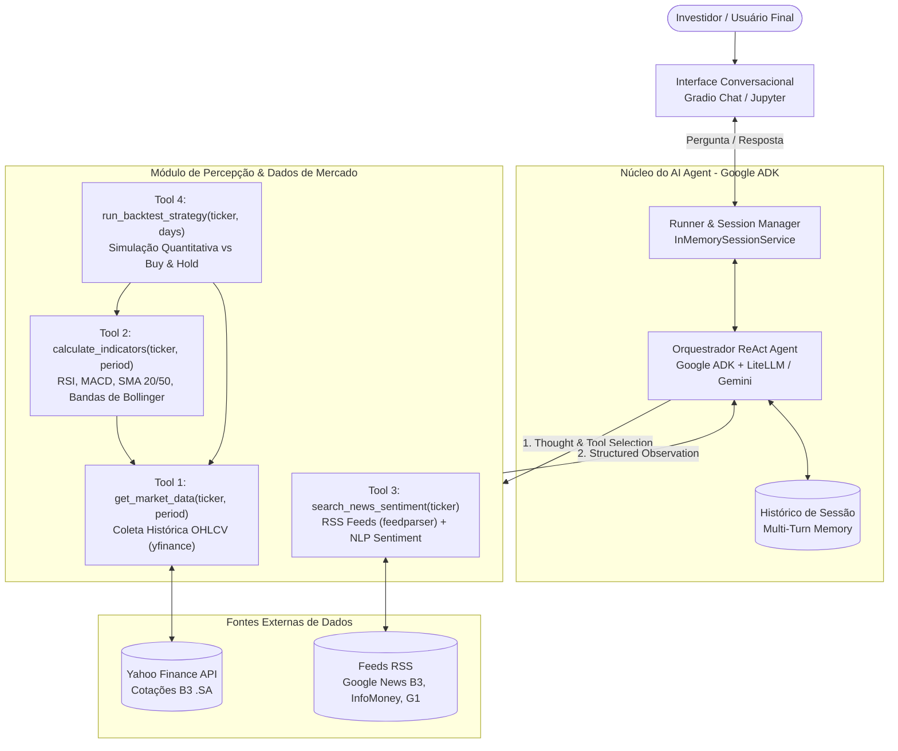
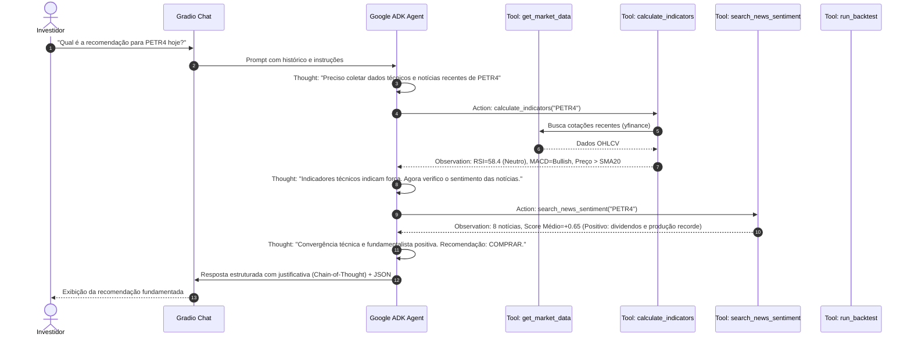

# Arquitetura do Sistema: QuantumFinance AI Investment Assistant

Documento de especificação técnica e arquitetura do Assistente de Investimentos baseado em **AI Agents**, desenvolvido para o Trabalho Final da disciplina **Agents and Agentic AI** (MBA em Data Engineering - FIAP).

---

## 1. Visão Geral da Arquitetura

O sistema implementa um agente autônomo baseado no paradigma **ReAct (Reasoning + Acting)**. Em vez de operar como uma consulta estática ou um pipeline engessado, o agente opera em ciclos de percepção, raciocínio (*Thought*), acionamento de ferramentas (*Action*), observação (*Observation*) e síntese decisória (*Final Recommendation*).

### Diagrama de Fluxo e Componentes (Mermaid)



---

## 2. Ciclo de Raciocínio (ReAct Execution Sequence)



---

## 3. Especificação das Ferramentas (Agent Tools)

### 3.1. `get_market_data(ticker: str, period: str = "60d") -> dict`
- **Objetivo**: Extrair dados diários de abertura, máxima, mínima, fechamento e volume (OHLCV) do ativo na B3.
- **Normalização**: Converte automaticamente tickers da B3 (ex: `VALE3` -> `VALE3.SA`).
- **Retorno**: Último preço de fechamento, variação percentual do período, volume médio e série temporal.

### 3.2. `calculate_technical_indicators(ticker: str, period: str = "90d") -> dict`
Calcula indicadores quantitativos clássicos:
- **RSI (Índice de Força Relativa - 14 períodos)**:
  $$\text{RSI} = 100 - \frac{100}{1 + \text{RS}}, \quad \text{onde } \text{RS} = \frac{\text{Média dos Ganhos}}{\text{Média das Perdas}}$$
  - *Interpretação*: $<30$ Sobrevendido (Oportunidade de Compra); $>70$ Sobrecomprado (Risco de Correção).
- **MACD (Convergência e Divergência de Médias Móveis)**:
  $$\text{MACD Line} = \text{EMA}_{12}(\text{Close}) - \text{EMA}_{26}(\text{Close})$$
  $$\text{Signal Line} = \text{EMA}_{9}(\text{MACD Line})$$
  $$\text{Histograma} = \text{MACD Line} - \text{Signal Line}$$
  - *Interpretação*: Cruzamento de alta (Bullish) ou cruzamento de baixa (Bearish).
- **Médias Móveis Simples (SMA 20 e SMA 50)**:
  - Avaliação de tendência de curto/médio prazo e cruzamento de médias (*Golden Cross* / *Death Cross*).
- **Bandas de Bollinger (20 períodos, 2 desvios-padrão)**:
  - Identificação de volatilidade e níveis de suporte/resistência dinâmica.

### 3.3. `search_news_sentiment(ticker: str, limit: int = 6) -> dict`
- **Fontes RSS**: Google News Brasil (focado no ativo e na B3), InfoMoney e G1 Economia via `feedparser`.
- **Análise de Sentimento (NLP)**:
  - Extração de manchetes e resumos das notícias mais recentes.
  - Classificação léxica/semântica em três classes: `Positivo`, `Negativo`, `Neutro`.
  - Cálculo do **Score de Impacto** ponderado variando de **-1.0** (extrema aversão a risco) a **+1.0** (forte otimismo).

### 3.4. `run_backtest_strategy(ticker: str, days: int = 60) -> dict`
- **Metodologia**: Simula a execução sistemática de um modelo baseado em regras derivadas do raciocínio do agente (cruzamento de MACD + RSI + Filtro de Sentimento) ao longo dos últimos $N$ dias úteis.
- **Benchmark**: Estratégia passiva de *Buy-and-Hold* do mesmo ativo no mesmo período.
- **Métricas Apuradas**:
  - Retorno acumulado do Agente (%)
  - Retorno acumulado do Buy & Hold (%)
  - Taxa de acerto de tendência (Acurácia %)
  - *Outperformance* (Alpha gerado)

---

## 4. Estrutura de Dados de Saída (Slide 7 do Enunciado)

Cada análise produz um registro canônico padronizado:

```json
{
  "ticker": "VALE3",
  "date": "2026-10-01",
  "close": 61.42,
  "rsi": 45.2,
  "macd_signal": "bullish",
  "news_sentiment": 0.72,
  "recommendation": "COMPRAR",
  "confidence_score": 0.85,
  "rationale": "RSI em zona neutra com cruzamento recente do MACD acima da linha de sinal e fluxo consistente de notícias positivas relativas à demanda de minério."
}
```

---

## 5. Interface de Interação (Gradio Conversational UI)

Seguindo o padrão arquitetural dos laboratórios ministrados pelo professor Felipe Teodoro:
- O agente é encapsulado em uma sessão interativa gerenciada por `InMemorySessionService`.
- Suporta perguntas abertas do usuário, tais como:
  - *"Por que você recomendou comprar PETR4 hoje?"*
  - *"Compare os indicadores de BBAS3 e ITUB4."*
  - *"Qual ação do setor financeiro está com melhor relação risco-retorno?"*
