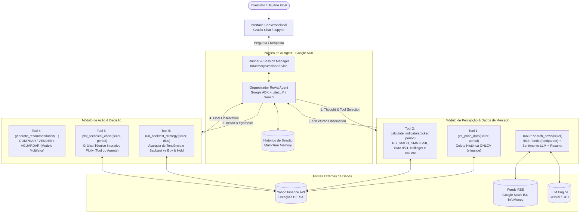

# 🚀 QuantumFinance — AI Investment Assistant
> **Trabalho Final da Disciplina:** *Agents and Agentic AI*  
> **Curso:** MBA em Data Engineering — **FIAP**  
> **Professor:** Felipe Gustavo Silva Teodoro  
> **Integrantes do Grupo:**
> - Fátima Beatriz Rodrigues
> - Jean Felipe Ertzogue
> - Luiz Soldatelli Neto
> - Ricardo Peixoto


## 📌 1. Visão Geral do Desafio

A **QuantumFinance** é uma instituição financeira em expansão no mercado de capitais que deseja oferecer aos seus clientes um **Assistente de Investimentos autônomo e explicável** baseado em **AI Agents**.

O assistente foi projetado para monitorar continuamente o mercado brasileiro (B3), coletar dados fundamentalistas, cotações e notícias financeiras em tempo real, raciocinar criticamente e emitir recomendações diárias fundamentadas de **COMPRA**, **VENDA** ou **MANUTENÇÃO (AGUARDAR)** para as 4 ações prioritárias do desafio:

| Ticker | Empresa | Setor de Atuação | Fonte de Cotações |
| :---: | :---: | :---: | :---: |
| **VALE3** | Vale S.A. | Mineração & Siderurgia | B3 (`yfinance`) |
| **PETR4** | Petrobras | Energia / Óleo & Gás | B3 (`yfinance`) |
| **BBAS3** | Banco do Brasil | Serviços Financeiros / Bancário | B3 (`yfinance`) |
| **ITUB4** | Itaú Unibanco | Serviços Financeiros / Bancário | B3 (`yfinance`) |

---

## 🏛️ 2. Arquitetura da Solução & Fluxo Mermaid

O assistente adota estritamente a metodologia **ReAct (Reasoning + Acting)** implementada com o framework oficial ensinado nas aulas, o **Google ADK** (`google-adk`), integrando ferramentas modulares e interface conversacional com **Gradio**.



---

## 🛡️ 2.1. Diferencial de Engenharia: Modo Resiliente com Fallback Offline (Graceful Degradation)
> [!TIP]
> **Alta Disponibilidade e Execução Sem Barreiras:**
> Em arquiteturas de dados de missão crítica, agentes de IA não podem falhar se a API de um provedor de LLM sofrer oscilações, atinja limites de requisições (*rate limits*) ou se o usuário não possuir créditos cadastrados.
> 
> O **QuantumAdvisor** incorpora o padrão de engenharia **Graceful Degradation**:
> 1. **Modo Conectado (LLM via Google ADK)**: Utiliza `gemini-2.5-flash` ou `gpt-4o-mini` orquestrado pelo Google ADK, com análise de sentimento de notícias diretamente via LLM.
> 2. **Modo Resiliente (Fallback Offline Determinístico)**: Caso nenhuma chave seja detectada, o agente aciona automaticamente um motor analítico fundamentado. Ele consome dados reais da B3 via `yfinance`, calcula matematicamente todos os indicadores técnicos (incluindo EMA e Volume), lê notícias reais via RSS (`feedparser`), classifica o sentimento por léxico financeiro, executa a decisão multifator via `generate_recommendation` e sintetiza o parecer com **Chain-of-Thought** e o **JSON estruturado do Slide 7**.
> 
> Isso garante **100% de reprodutibilidade** no **Google Colab**, **Databricks Community Edition (Free)** ou em qualquer terminal local sem custo e sem atrito.

---

## 🧠 3. As Três Dimensões do AI Agent

### 👁️ A. Percepção (Perception)
* **Preços e Volumes em Tempo Real**: Coleta de dados OHLCV da B3 via `yfinance` (`get_price_data`).
* **Indicadores Gráficos Quantitativos**: Extração matemática de (`calculate_indicators`):
  * **RSI (14 períodos)**: Detecção de zonas de sobrecompra (>70) ou sobrevenda (<30).
  * **MACD (12, 26, 9)**: Cruzamento de médias exponenciais e histograma de aceleração (*bullish* / *bearish*).
  * **Médias Móveis Simples (SMA 20 e 50) e Exponenciais (EMA 9 e 21)**: Tendência de curto e médio prazo e sinal de cruzamento.
  * **Bandas de Bollinger (20, ±2σ)**: Volatilidade e limites de envelopes.
  * **Análise de Volume**: Volume relativo (5d/20d) para confirmação de tendência e On-Balance Volume (OBV).
* **Leitura de Notícias & Sentimento em Tempo Real**: Parser de feeds RSS (`search_news`) com **classificação de sentimento por LLM**, score de impacto por ação e **resumo automático dos principais eventos**.

### 🧩 B. Raciocínio (Reasoning & Chain-of-Thought)
* **Análise de Sentimento (NLP / LLM)**: Processamento e pontuação ponderada das manchetes mais recentes em uma escala contínua de **-1.0** (forte aversão) a **+1.0** (forte otimismo) com peso de impacto.
* **Raciocínio Transparente**: O agente explicita cada etapa do pensamento (*Thought → Action → Observation*) antes de tomar uma decisão, registrando todas as ferramentas acionadas.

### ⚡ C. Ação (Action & Decision)
* **Recomendação Oficial**: Emissão de parecer formal (**COMPRAR**, **VENDER** ou **AGUARDAR**) acionando a ferramenta dedicada `generate_recommendation`.
* **Estrutura de Saída Canônica** (conforme solicitado no Slide 7 do enunciado):
  ```json
  {
    "ticker": "VALE3",
    "date": "2026-10-06",
    "close": 61.42,
    "rsi": 45.2,
    "macd_signal": "bullish",
    "news_sentiment": 0.72,
    "recommendation": "COMPRAR"
  }
  ```
* **Simulação de Backtest**: Comparação de retorno financeiro e acurácia de tendência em 5 dias (`run_backtest_strategy`) em relação ao benchmark de *Buy-and-Hold*.
* **Visualização como Tool**: Geração de gráficos técnicos interativos Plotly (`plot_technical_chart`) acionados de forma autônoma pelo agente.
* **Interface Conversacional**: Suporte a consultas em linguagem natural via **Gradio Chat** (ex.: *"Por que você recomendou comprar PETR4 hoje?"*).

---

## 📊 4. Matriz de Atendimento à Rubrica da Disciplina

| Item do Enunciado | Requisito Solicitado | Implementação no Projeto | Status |
| :---: | :--- | :--- | :---: |
| **01** | **Coleta e Pré-processamento** | Integração aberta de dados OHLCV via `yfinance` e RSS via `feedparser`. | ✅ Concluído |
| **02** | **Análise de Sentimento** | Classificação de notícias via LLM (ou léxico fallback), score de impacto e resumo dos eventos. | ✅ Concluído |
| **03** | **AI Agent com Tools** | Agente construído com **Google ADK** contendo 6 ferramentas ativas e ciclo ReAct explícito. | ✅ Concluído |
| **04** | **Recomendações e Backtest** | Emissão via `generate_recommendation`, acurácia de tendência (5d) e simulação vs Buy & Hold. | ✅ Concluído |
| **Bônus** | **Interface Conversacional** | Chat interativo implementado com `gradio` com visualizador gráfico integrado. | ✅ Concluído |
| **Bônus** | **Visualização Gráfica** | Ferramenta `plot_technical_chart` acionável pelo agente gerando gráficos técnicos em Plotly. | ✅ Concluído |

---

## 💻 5. Como Executar o Projeto

### Opção A: Executar no Google Colab (Recomendado)
1. Acesse o [Google Colab](https://colab.research.google.com/).
2. Faça o upload do arquivo [`Trabalho_Final_QuantumFinance_AI_Agent.ipynb`](file:///c:/Users/Ricardo/Projetos/agents-and-agentic-ai/Trabalho_Final_QuantumFinance_AI_Agent.ipynb).
3. Execute as células sequencialmente. O notebook possui suporte tanto para chaves da **API do Google Gemini** quanto da **OpenAI**, além de um modo de execução determinística local caso nenhuma chave seja informada.

### Opção B: Executar Localmente
```bash
# Clone ou acesse o repositório
cd c:/Users/Ricardo/Projetos/agents-and-agentic-ai

# Instale as dependências (usando uv ou pip)
uv run --python 3.12 --with jupyter jupyter notebook Trabalho_Final_QuantumFinance_AI_Agent.ipynb
# Ou alternativamente:
# pip install google-adk google-genai litellm yfinance feedparser pandas numpy plotly gradio requests
# jupyter notebook Trabalho_Final_QuantumFinance_AI_Agent.ipynb
```

---

## 📁 6. Estrutura do Repositório

```
agents-and-agentic-ai/
├── README.md                                      # Apresentação do projeto e instruções de execução
└── Trabalho_Final_QuantumFinance_AI_Agent.ipynb    # Jupyter Notebook executável (Entrega Oficial)
```

---
*FIAP — MBA em Data Engineering | Disciplina: Agents and Agentic AI*

